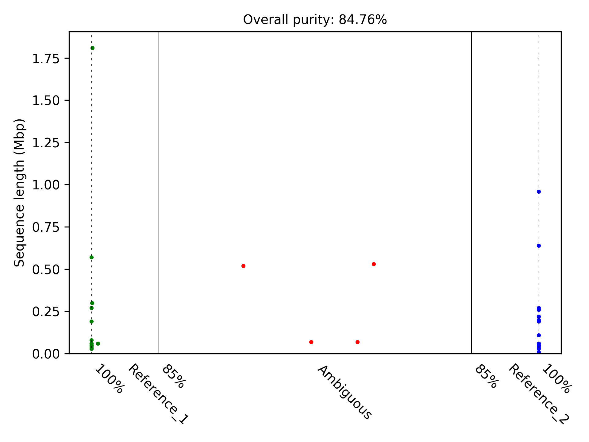

## Some scripts for PacBio metagenomic data processing

### Publication
---

+ In preparation
+ Contact: Weizhi Song (songwz03@gmail.com)
+ Affiliation: The Centre for Marine Bio-Innovation (CMB), The University of New South Wales, Sydney, Australia

### Extract reads from SAM file
---

1. Help information

        python3 get_reads_from_sam.py -h

        arguments:
          -h, --help      show this help message and exit
          -sam            Input sam file
          -ctgs           Contig id list
          -option         Specify '1' to get reads mapped to provided contigs, or '0' to get unmapped reads
          -out            Output reads

1. Contig id file format (one id per line)

        ctg_1
        ctg_2
        ctg_3

1. Example commands

        # get reads mapped to provided contigs
        $ python3 get_reads_from_sam.py -sam input.sam -ctg ctg_ids.txt -option 1 -out mapped_reads.fasta

        # get reads not mapped to provided contigs
        $ python3 get_reads_from_sam.py -sam input.sam -ctg ctg_ids.txt -option 0 -out unmapped_reads.fasta

### Purity assessment for diploid assemblies
---

1. Help information

        python3 get_purity.py -h

        arguments:
          -h, --help    show this help message and exit
          -r R          folder holds reference sequences
          -x X          the extension of reference files
          -q Q          query sequences
          -n N          the total number of reads need to be simulated
          -p P          purity cut-off for reference assignment, default: 85
          -l L          the length of simulated reads, default: 250
          -i I          the insert size of simulated reads, default: 500
          -m M          the minimum number of mapped reads required for purity
                        calculation, NON-ZERO, default: 500
          -bbmap BBMAP  path to BBMAP executable file, default: bbmap.sh
          -circle       specify to simulate reads crossing the break point if the
                        reference sequences are circularized
          -split        specify to export simulated forward and reverse reads into
                        separate files
          -keep_temp    specify to keep temporary files
          -quiet        specify to suppress reporting information

1. Example commands

        # assess the purity of query contigs with one million short reads simulated from provided reference genomes
        $ python3 get_purity.py -r ref_genome_folder -x fasta -q query_contigs.fasta -n 1000000

1. Output purity results

        Sequence_ID	Assignment	Purity(%)	Length(Mbp)
        Ctg_A2	Reference_1	100.0	0.06
        Ctg_A3	Reference_1	99.76	1.81
        Ctg_A4	Reference_2	100.0	0.05
        Ctg_A5	Reference_1	99.85	0.3
        Ctg_B2	Reference_2	100.0	0.06
        Ctg_B4	Reference_1	100.0	0.08
        Ctg_A1	Ambiguous	40.54/59.46	0.07
        Ctg_B1	Ambiguous	50.88/49.12	0.07

1. Output plot

    

